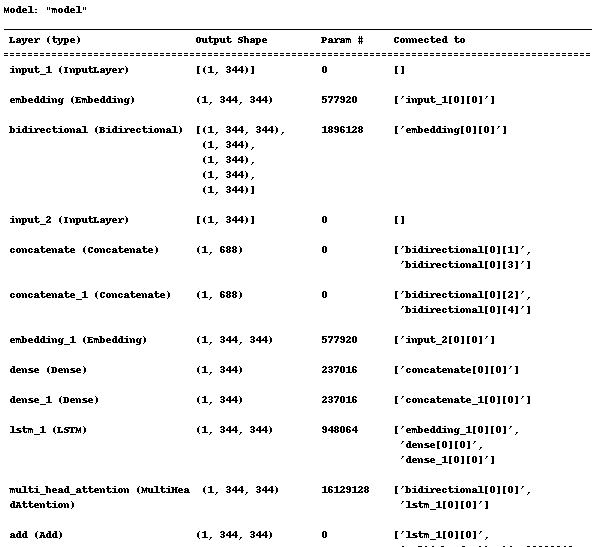
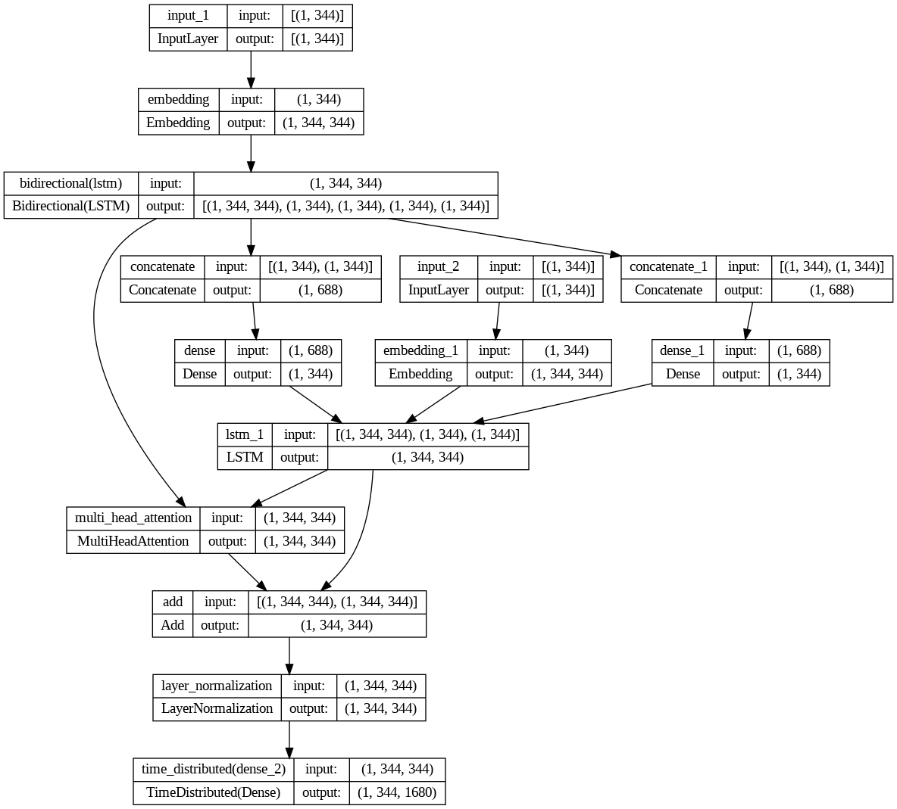
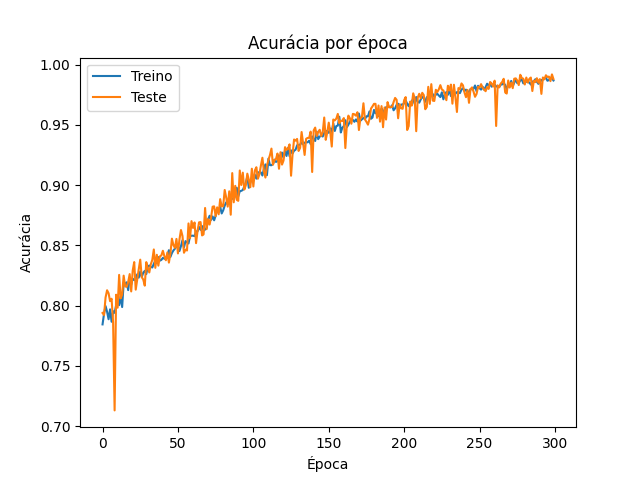
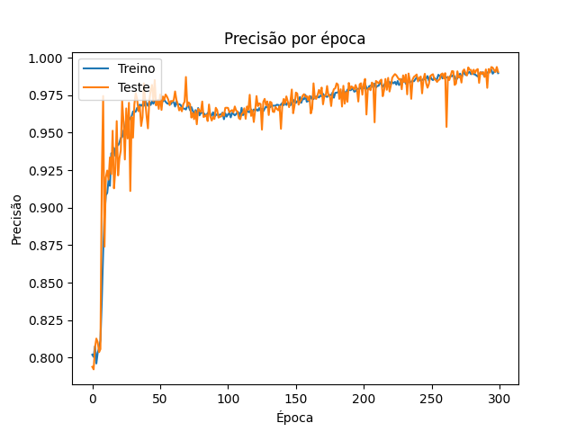
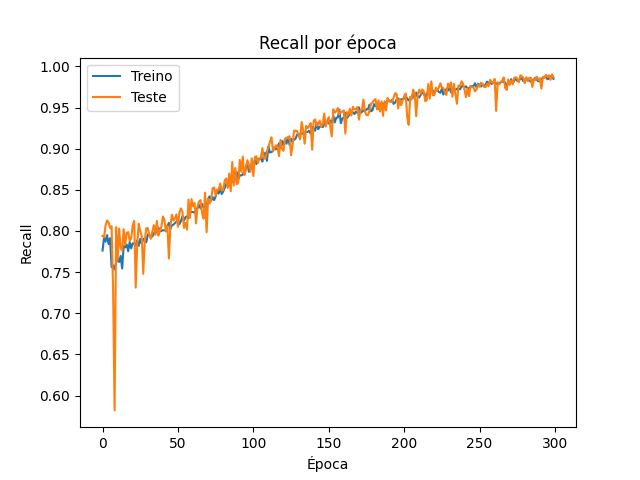

# Transbot - (colocar o nome quando tiver)

**PT-BR:** Implementação de um chatbot para o processo transexualizador utilizando redes neurais recorrentes e processamento de liguagem natural escrita em português.

**EN-US:** Implementation of a chatbot for the transsexualization process using recurrent neural networks and natural language processing written in portuguese.

## Main Dependences
- Python 3
- Keras 2.11
- spacy
- autocorrect
- Websocket
- FastAPI

## Author

- [Andrigo Borba dos Santos](https://github.com/andrigoBS)

## Model

## Result Graphics

